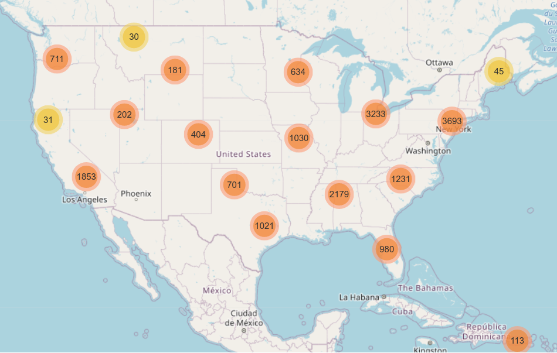

    

# Bank Score. 
## It's Like Creidt Score, but for banks.

Ranking banks according to the number and type of complaints they receive. Presenting data through plots, graphs, and maps.

## Inspiration

We wanted to know if we can use the US consumer base and their complaints against financial institutions to rank banks. We also wanted to see the trends associated with financial consumer complaints through data visualization.

## What it does

Our project is currently a **collection of Jupyter Notebooks** where we first **wrangle data** into useful material, then **extract some insights**, and finish it off with **more data wrangling** to extract geo-data and **build an interactive map**.

## Results

### Highest Number of Complaints

We found that the companies with the most number of complaints are **Equifax**, **TRANSUNION INTERMEDIATE HOLDINGS**, and **Experian Information Solutions**, who each have around **130,000 complaints**. The worst three are then followed by the **Bank of America**, **Wells Fargo**, and **JPMorgan Chase**, having around **50,000 complaints** each.

### Highly Rated Companies

We also rated the companies in our data according to the way they respond to complaints, such as if they respond with monetary relief and provide timely response. The most highly rated institutions were **IQOR US**, **Capio Partners**, and **The CMI Group**, who all have almost a perfect score of 100%.

### Poorly Rated Companies

The companies with the lowest ratings are **Wells Fargo** with 52% rating, **Equifax** with 4% rating, and **TRANSUNION INTERMEDIATE HOLDINGS** with 0% rating. We can see the connection between the number of complaints these companies receive and their poor rating.

### Clustering Complaints by Zip Codes

We also produced an **interactive map** using the available Zip Code numbers. We were able to **group complaints according to their Zip Code coordinates** and then **put them on the map** using useful libraries, *uszipcode* and *folium*.

## Dataset

The dataset is provided by the **<a href="https://www.consumerfinance.gov/data-research/consumer-complaints/" target="__blank">Consumer Financial Protection Bureau</a>**. The dataset initially includes around **2,050,540 entries across 18 columns**, each entry representing a consumer complaint. After cleaning and dropping values that are unprocessable due to consumers choosing not to disclose some information, there are **1,057,135 entries**.

First four entries:

|Complaint ID |Date received|Product                                          |Sub-product                               |Issue                               |Sub-issue                          |Consumer complaint narrative|Company public response                          |Company                            |State|ZIP code|Tags|Consumer consent provided?|Submitted via|Date sent to company|Company response to consumer   |Timely response?|Consumer disputed?|
|------------|-------------|-------------------------------------------------|------------------------------------------|------------------------------------|-----------------------------------|----------------------------|-------------------------------------------------|-----------------------------------|-----|--------|----|--------------------------|-------------|--------------------|-------------------------------|----------------|------------------|
|         |             |                                                 |                                          |                                    |                                   |                            |                                                 |                                   |     |        |    |                          |             |                    |                               |                |                  |
|3379500     |2019-09-19   |Credit reporting, credit repair services, or o...|Credit reporting                          |Incorrect information on your report|Information belongs to someone else|NaN                         |Company has responded to the consumer and the ...|Experian Information Solutions Inc.|PA   |15206   |NaN |Consent not provided      |Web          |2019-09-20          |Closed with non-monetary relief|Yes             |NaN               |
|3255455     |2019-05-23   |Checking or savings account                      |Checking account                          |Managing an account                 |Deposits and withdrawals           |NaN                         |Company has responded to the consumer and the ...|MIDFIRST BANK                      |AZ   |85254   |NaN |NaN                       |Referral     |2019-05-28          |Closed with explanation        |Yes             |NaN               |
|4267123     |2021-04-02   |Credit reporting, credit repair services, or o...|Credit reporting                          |Incorrect information on your report|Information belongs to someone else|NaN                         |NaN                                              |EQUIFAX, INC.                      |PA   |19403   |NaN |NaN                       |Web          |2021-04-02          |Closed with explanation        |Yes             |NaN               |
|3446074     |2019-11-20   |Credit card or prepaid card                      |General-purpose credit card or charge card|Closing your account                |Company closed your account        |NaN                         |Company has responded to the consumer and the ...|PENTAGON FEDERAL CREDIT UNION      |VA   |22304   |NaN |NaN                       |Referral     |2019-11-21          |Closed with explanation        |Yes             |NaN               |

Columns and their descriptions:

|**Field name**| Description|
|---|---|
|**Date received**|The date the CFPB received the complaint.|
|**Product**|The type of product the consumer identified in the complaint.|
|**Sub-product**|The type of sub-product the consumer identified in the complaint.|
|**Issue**|The issue the consumer identified in the complaint.|
|**Sub-issue**|The sub-issue the consumer identified in the complaint.|
|**Consumer complaint narrative***|Consumer complaint narrative is the consumer-submitted description of “what happened” from the complaint.|
|**Company public response****|The company’s optional, public-facing response to a consumer’s complaint.|
|**Company**|The complaint is about this company.|
|**State**|The state of the mailing address provided by the consumer.|
|**ZIP code*****|The mailing ZIP code provided by the consumer.|
|**Tags**|Data that supports easier searching and sorting of complaints submitted by or on behalf of consumers.|
|**Consumer consent provided?**|Identifies whether the consumer opted in to publish their complaint narrative.
|**Submitted via**|How the complaint was submitted to the CFPB.|
|**Date sent to the company**|The date the CFPB sent the complaint to the company.|
|**Company response to consumer**|This is how the company responded.|
|**Timely response?**|Whether the company gave a timely response.|
|**Consumer disputed?**|Whether the consumer disputed the company’s response.|
|**Complaint ID**|The unique identification number for a complaint.|

 
 Term Clarifications

*Consumers must opt-in to share their narrative. We will not publish the narrative unless the consumer consents, and consumers can opt-out at any time. The CFPB takes reasonable steps to scrub personal information from each complaint that could be used to identify the consumer.    
    
**Companies can choose to select a response from a pre-set list of options that will be posted on the public database. For example, “Company believes complaint is the result of an isolated error.”    
    
***This field may: i) include the first five digits of a ZIP code; ii) include the first three digits of a ZIP code (if the consumer consented to publication of their complaint narrative); or iii) be blank (if ZIP codes have been submitted with non-numeric values, if there are less than 20,000 people in a given ZIP code, or if the complaint has an address outside of the United States).
    

### Clean Dataset

You can find the clean dataset we made here, <a href="https://drive.google.com/file/d/1mYJws7uPjbPqPszUQHpf4PfrHSEjAVIu/view?usp=sharing" target="__blank">.pkl</a> and <a href="https://drive.google.com/file/d/1fayiycfrGHsO3aqEGo7J5lDLWiPvfNZ7/view?usp=sharing" target="__blank">.csv</a>. The clean dataset:
* has all the necessary columns in a proper data type, such as dates and strings.
* only represents entries with a proper ZIP code (full, 5-digit zipcodes).
* and has no NaNs for the ZIP codes (for visualization).

## Mapping

To use the map notebook, please first download the <a href="https://drive.google.com/file/d/1g-9q7Dcbii6V0Iyk7p_L-8iJeEpGwyaM/view?usp=sharing" target="__blank">complaints.json</a> file