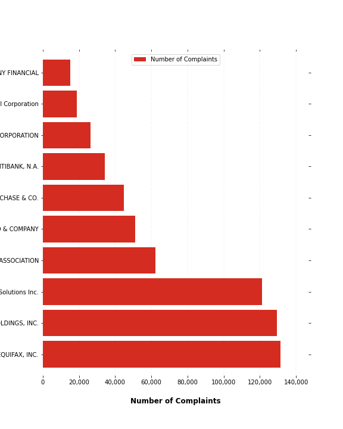
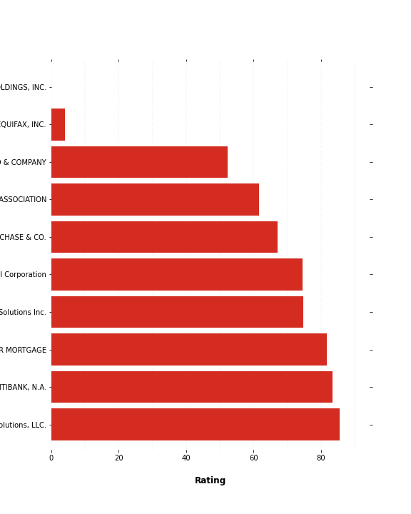

# Bank Score. 
## It's Like Creidt Score, but for banks.

    

## Results

By doing this hack, we ranked financial institutions based on the number of complaints they have at the [Consumer Financial Protectioin Bureau](https://www.consumerfinance.gov/). We also built an interactive map to show where those complaints have been made.

This hack is useful for consumers to know which banks and financial institutions they can go to when applying for a credit card, loan, or mortgage. 

The top 10 worst companies, according to the number of complaints:

In our rating, the top 10 worst companies that didn't handle they responses to consumers well are:

The map where most of those complaints have been made, based on ZIP codes (click on it to go to interactive map):

## Dataset

In the original dataset, we have around 2 million entries. Each entry represents a single complaint.

|**Field name**| Description|
|---|---|
|**Date received**|The date the CFPB received the complaint.|
|**Product**|The type of product the consumer identified in the complaint.|
|**Sub-product**|The type of sub-product the consumer identified in the complaint.|
|**Issue**|The issue the consumer identified in the complaint.|
|**Sub-issue**|The sub-issue the consumer identified in the complaint.|
|**Consumer complaint narrative***|Consumer complaint narrative is the consumer-submitted description of “what happened” from the complaint.|
|**Company public response****|The company’s optional, public-facing response to a consumer’s complaint.|
|**Company**|The complaint is about this company.|
|**State**|The state of the mailing address provided by the consumer.|
|**ZIP code*****|The mailing ZIP code provided by the consumer.|
|**Tags**|Data that supports easier searching and sorting of complaints submitted by or on behalf of consumers.|
|**Consumer consent provided?**|Identifies whether the consumer opted in to publish their complaint narrative.
|**Submitted via**|How the complaint was submitted to the CFPB.|
|**Date sent to the company**|The date the CFPB sent the complaint to the company.|
|**Company response to consumer**|This is how the company responded.|
|**Timely response?**|Whether the company gave a timely response.|
|**Consumer disputed?**|Whether the consumer disputed the company’s response.|
|**Complaint ID**|The unique identification number for a complaint.|

*Consumers must opt-in to share their narrative. We will not publish the narrative unless the consumer consents, and consumers can opt-out at any time. The CFPB takes reasonable steps to scrub personal information from each complaint that could be used to identify the consumer.    
    
**Companies can choose to select a response from a pre-set list of options that will be posted on the public database. For example, “Company believes complaint is the result of an isolated error.”    
    
***This field may: i) include the first five digits of a ZIP code; ii) include the first three digits of a ZIP code (if the consumer consented to publication of their complaint narrative); or iii) be blank (if ZIP codes have been submitted with non-numeric values, if there are less than 20,000 people in a given ZIP code, or if the complaint has an address outside of the United States).
    

## Clean Dataset

You can find the clean dataset we made here, <a href="https://drive.google.com/file/d/1mYJws7uPjbPqPszUQHpf4PfrHSEjAVIu/view?usp=sharing" target="__blank">.pkl</a> and <a href="https://drive.google.com/file/d/1fayiycfrGHsO3aqEGo7J5lDLWiPvfNZ7/view?usp=sharing" target="__blank">.csv</a>. The clean dataset:
* has all the necessary columns in a proper data type, such as dates and strings.
* only represents entries with a proper ZIP code (full, 5-digit zipcodes).
* and has no NaNs for the ZIP codes (for visualization).

## Mapping

To use the map notebook, please first download the <a href="https://drive.google.com/file/d/1g-9q7Dcbii6V0Iyk7p_L-8iJeEpGwyaM/view?usp=sharing" target="__blank">complaints.json</a> file